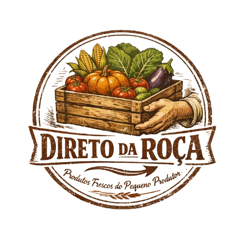

 

  

 

# Direto da Roça

### THE VISION
In a world with such complex supply chains, there is no easier route between a healthy meal and a healthy community than between a local producer and a local consumer. This project, inspired by successful online databases such as Portugal’s Reforma Agrária and with the hope of expanding to a national scale in Brazil in the future, aims to provide a connection between small farmers and urban areas in Parasuráh, Brazil.

### Why This Project Exists
Agriculture is Brazil's lifeline. However, small family farming operations are struggling to reach their own markets because they lack visibility and are dependent on intermediaries. We are passionate about technology that benefits the earth and those who take care of it.

### Our Core Goals:
Empowering the Small Producer: Providing family farms with an online presence to display their relevant seasonal produce and earth services.

Food Sovereignty
  Promoting the consumption of local, organic, and agroecological products. Reducing the carbon footprint of food transport. Transparency & Trust: Creating a direct connection for consumers so they know exactly who is raising their vegetables and how they are grown. Rural Development: Encouraging the local economy of the Paraná cities to ensure that wealth remains within the community.

